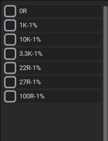
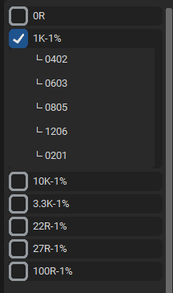
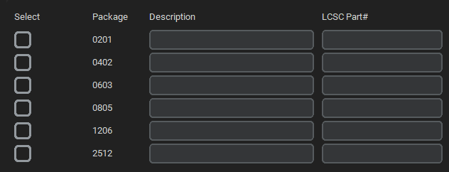
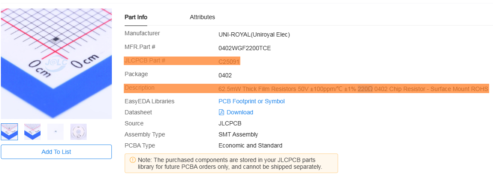
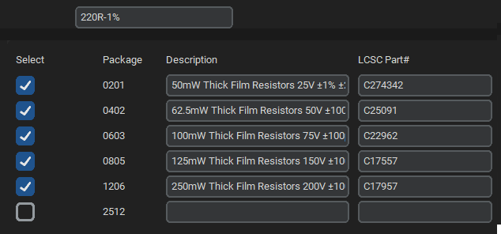

# Eagle Library Device Adder

A simple GUI tool to quickly add or update resistor (and other) devices in your Eagle `.lbr` or `.xml` library. This tool parses an existing Eagle library, lets you select packages, fill in descriptions and LCSC part numbers, and then automatically creates or merges devicesets—all with a modern dark-themed interface built in CustomTkinter.

---

## Table of Contents

1. [Features](#features)
2. [Prerequisites](#prerequisites)
3. [Installation](#installation)
4. [Folder Structure](#folder-structure)
5. [Usage](#usage)
    - [Launching the App](#launching-the-app)
    - [Loading a Library](#loading-a-library)
    - [Viewing Existing Devicesets](#viewing-existing-devicesets)
    - [Adding a New Device](#adding-a-new-device)
    - [Merging into an Existing Deviceset](#merging-into-an-existing-deviceset)
6. [Screenshots](#screenshots)
7. [Configuration](#configuration)
8. [Known Limitations & Future Improvements](#known-limitations--future-improvements)
9. [License](#license)

---

## Features

- **Browse & parse** any Eagle library (`.lbr` or `.xml`) to view existing devicesets.
- **Collapsible tree** on the left panel showing all devicesets and their packages.
- **Template-based device creation**: automatically copy the structure from a “template” deviceset (e.g. name=`DEVICE_NAME`).
- **Package selection** on the right panel with checkboxes—each selected package enables two input fields:
    - **Description**
    - **LCSC Part#**
- **Automatic merging**: if you add a device with the same name but different packages, the tool will merge new packages into that existing deviceset rather than duplicating it.
- **Dark‐themed, modern UI** powered by [CustomTkinter](https://github.com/TomSchimansky/CustomTkinter).
- **Configurable window size, button colors, and panel dimensions** via `config.py`.

---

## Prerequisites

- **Python 3.7+** (recommended)
- **CustomTkinter** (for the dark‐themed GUI)
- **lxml** or Python’s built‐in `xml.etree.ElementTree` (the code uses the built‐in `xml.etree` module by default, so no extra libraries are strictly required unless you modify `xml_handler.py`)
- **tkinter** (standard with most Python distributions)

To install CustomTkinter, run:

```bash
pip install customtkinter
```

---

## Installation

Clone this repository (or download and extract the ZIP):

```bash
git clone https://github.com/DvidMakesThings/WINAPP_Add_Eagle_Parts.git
cd WINAPP_Add_Eagle_Parts
```

Install dependencies (if not already installed):

```bash
pip install customtkinter
```

(Optional) If you plan to use a more robust XML parser than Python’s built‐in module (e.g. lxml), install it now:

```bash
pip install lxml
```

Otherwise, the default code will work with Python’s standard library.

---

## Folder Structure

```
eagle-library-device-adder/
│
├── config.py
│   # Window size, resizable flags, button colors, and panel dimensions.
│
├── xml_handler.py
│   # Utility functions for parsing/modifying the Eagle library XML.
│
├── gui/
│   ├── app.py
│   │   # Main application class (EagleLibraryGUI).
│   │   # Builds the top controls, left panel, right panel, and action buttons.
│   ├── top_controls.py
│   │   # Contains TopControlsFrame, which houses the “Browse” button, path entry,
│   │   # “Load Packages” button, and new deviceset name entry.
│   ├── left_panel.py
│   │   # ExistingDevicesPanel: shows a collapsible list of all devicesets and their packages.
│   ├── right_panel.py
│   │   # PackageSelectionPanel: draws its own header row and one row per package with checkboxes and entry fields.
│   └── action_buttons.py
│       # ActionButtonsFrame: houses the “Add Device” (green) and “Quit” (red) buttons.
│
├── images/
│   └── (placeholder for screenshots, e.g. browse_btn.png, left_panel.png, right_panel.png)
│
└── README.md
    # This file.
```

---

## Usage

### Launching the App

Open a terminal and run:

```bash
cd WINAPP_Add_Eagle_Parts
python eagle_editor.py
```

You should see a dark‐themed window appear, roughly 900×650 pixels in size (unless you change `config.py`).

If you need to reference a specific Python interpreter (e.g. `python3`):

```bash
python3 eagle_editor.py
```

---

### Loading a Library

1. Click **Browse** to open a file picker.
2. Select an existing Eagle library file (`.lbr` or `.xml`).
3. Once you pick a valid file, the **Load Packages** button will become enabled (green).
4. Click **Load Packages**.

This will parse the library and display:

- **Left panel:** All existing `<deviceset>` entries (with their child packages hidden by default).
- **Right panel:** A scrollable list of packages from the “template” deviceset (named `DEVICE_NAME` in your XML).

---

### Viewing Existing Devicesets

On the left panel, you’ll see a list of deviceset names, each with a checkbox:



Click the checkbox next to a deviceset to expand it and reveal its packages:



---

### Adding a New Device

In the right panel, scroll through the packages listed (these come from the library’s template deviceset). Each row has four columns:



- **Column 0 (“Select”):** A checkbox
- **Column 1 (“Package”):** Package name (e.g. 0402)
- **Column 2 (“Description”):** Disabled until you check Column 0
- **Column 3 (“LCSC Part#”):** Disabled until you check Column 0

Check one or more packages you wish to include in your new deviceset. As soon as you check a box, the Description and LCSC fields for that row become editable.

Fill in the Description and LCSC Part# for every package you checked. If you leave either field blank, that package will be skipped and not added.

In the **New Device Set Name** field (at the top), enter a name (e.g. `220R-1%`).

Click **Add Device** (the green button at the bottom).

- If a deviceset with that name does not yet exist, a brand‐new `<deviceset>` is created.
- If a deviceset with that name already exists, your chosen packages (with their Description and LCSC) are merged into that existing deviceset (no duplicates).

From the [JLCPCB Parts Library](https://jlcpcb.com/parts), select the desired part you want to add, and copy these fields into the GUI:



When all the needed devices are added, the gui shall look similar:



After clicking "Add device", a pop‐up will summarize what happened, e.g.:

```
Created deviceset '0R' with 3 package(s).
Skipped (missing fields): 0805
```
or

```
Deviceset '0R' already exists.
→ 1 updated, 2 added.
Skipped (missing fields): 0603
```

After you click OK on the pop‐up, the left panel automatically refreshes so you see your newly‐created or updated deviceset immediately.

---

### Merging into an Existing Deviceset

If you enter a name that already exists in the library, the tool will:

- Look up that `<deviceset name="...">`.
- For each package you checked:
    - If that package already exists in the deviceset, it updates the `<attribute>` values (Description and LCSC) if they differ.
    - If that package is new, it adds a new `<device name="…">` entry under the `<devices>` block.

A summary pop‐up tells you exactly how many packages were updated vs added.

---

## Screenshots

Below are a few example screenshots. Replace these placeholders with your actual images in `images/` before publishing.

- Initial Launch (empty panels)
- After Loading Library
- Selecting Packages on Right Panel
- After Adding “0R” Deviceset

---

## Known Limitations & Future Improvements

- **Template deviceset assumption:** By default, the code looks for a `<deviceset name="DEVICE_NAME">` as a “template.” If you don’t have that exact name, it picks the first `<deviceset>` it finds. You can modify `xml_handler.find_template_deviceset(...)` if you need different logic.
- **No validation of LCSC Part# format:** The tool only checks that both Description and LCSC are non‐empty. If you want to enforce, e.g., “CXXXXX” or numeric‐only, you’ll need to add extra validation logic.
- **Limited XML backup:** The program overwrites your original `.lbr`/`.xml`. You may wish to manually back it up (e.g. `library.lbr` → `library_backup.lbr`) before running.
- **Single‐threaded UI:** Parsing large libraries may hang the UI briefly. Future versions might use a background thread to keep the GUI responsive.
- **More complex merging logic:** Currently, merging only updates the DESCRIPTION and LCSC_PART attribute values inside `<technology>` for an existing `<device>`. If you need to merge against multiple `<technology name="...">` blocks or advanced attributes, you’ll need to extend `xml_handler.merge_into_deviceset(...)`.

---

## License

This project is licensed under the **GPL-3.0 License**. See the [LICENSE](LICENSE)
file for details.

## Contact

For questions or feedback:
- **Email:** [dvidmakesthings@gmail.com](mailto:dvidmakesthings@gmail.com)
- **GitHub:** [DvidMakesThings](https://github.com/DvidMakesThings)